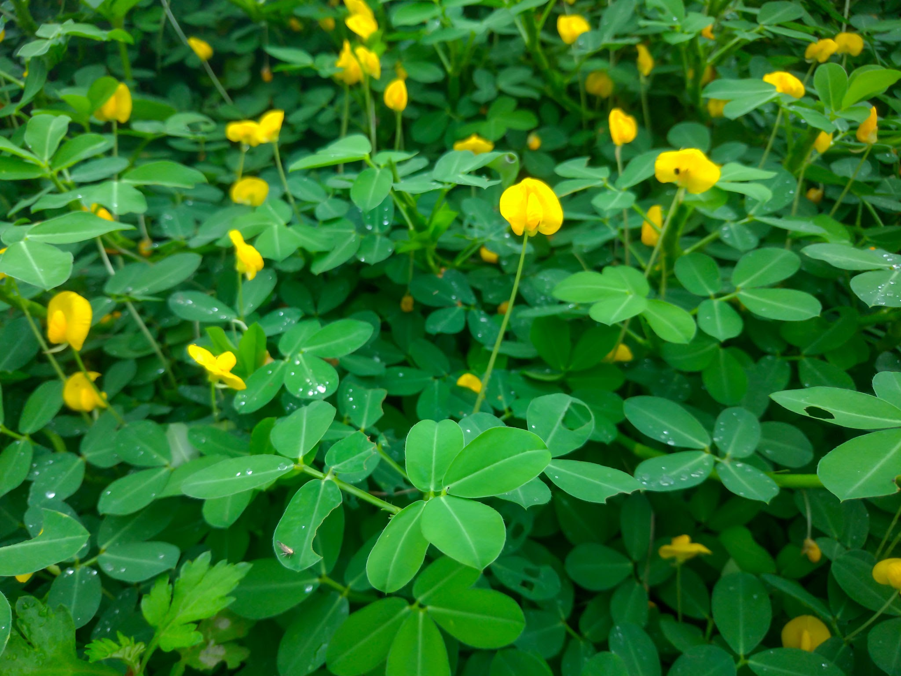
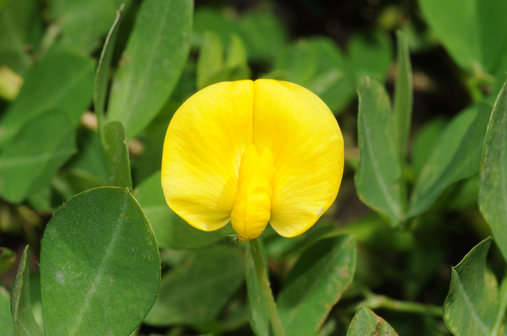
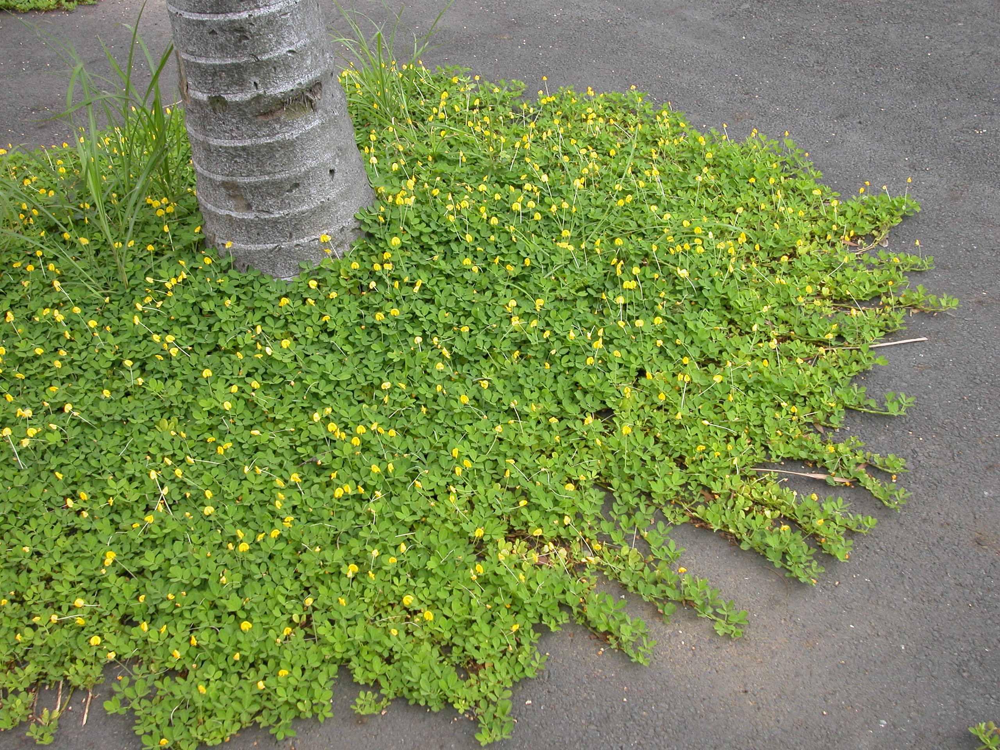
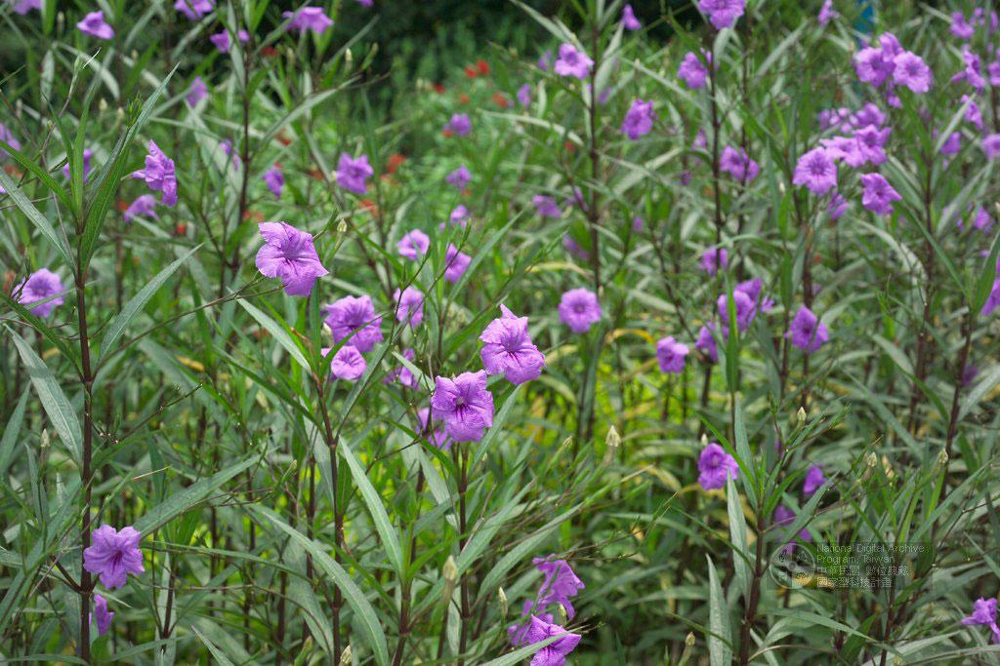
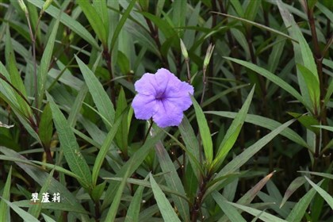
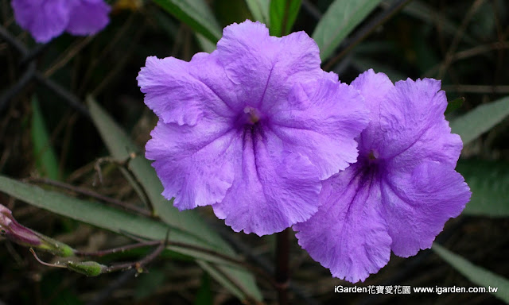

# 除草

---
# 教學資源
## YouTube：
- {[[老農筆記]](https://www.youtube.com/@%E8%80%81%E8%BE%B2%E7%AD%86%E8%A8%98)} |
  - [日本老農不外傳的減草祕籍！(23:38)](https://www.youtube.com/watch?v=ow-tawheagU)
  - [你菜园的草在替土壤喊救命！看懂这张表，5分钟免费体检，不花一分钱！(14:08)](https://www.youtube.com/watch?v=OUeCTz0ILq4)
    > 植物生態學和土壤化學 | 雜草出現不是隨機，表示是被土壤的酸鹼度、壓實程度和營養結構所召換出來，例：酢漿草說明土壤缺鈣偏酸
  - [彎腰拔草太傷身！這5種「地被神器」種一次管三年，菜地乾淨還能讓蔬菜產量翻倍！(26:32)](https://www.youtube.com/watch?v=_kRdu-frgs0)
    > 每一次除草、翻地，就等於給那些沉睡的雜草籽創造了一次全新的發芽條件。
    > - 以草治草：⑴留下有益的草(緑肥、花、藥草)。⑵地下根系的物理封鎖和化學攻繫。葡萄百里香、活血丹 | 白花三葉草、馬齒莧(豬母乳)、芳香萬壽菊
    > - 生態位搶佔：利用特定植物去佔據菜地周圍的地盤，讓雜草找不到資源生長。
    > - 活覆蓋壓草：
- [不打除草劑、不用防草布，日本“自然農法”，不花錢教你生態防草(04:18)](https://www.youtube.com/watch?v=oUKxcYOYO7w) | 松樹皮-> 自然農法
- [割下的草該如何處理？別再犯這些錯誤了(08:58)](https://www.youtube.com/watch?v=vyoJ5t44Jzo)

## 緑肥
### 蔓花生
> 蔓花生（學名：Arachis pintoi，又稱地毯花生、觀賞花生）是一種多年生匍匐性豆科植物，原產於南美洲，目前在臺灣常被作為地被植物、水土保持植物及果園綠肥植物使用。
> 蔓花生的主要優點：生長快速、黃花美觀、管理容易、耐熱耐旱、病蟲害少、固氮改良土壤、抑制雜草效果佳、可取代部分草坪。對臺灣氣候而言，蔓花生是非常優秀的地被植物，尤其適合住宅庭園、校園、公園及果園草生栽培，能同時兼顧美觀、環保與降低維護成本。

  
  
  

#### 🍀 植物特徵
- 外觀特徵：
  - 植株高度約 5～20 公分。
  - 莖呈匍匐狀沿地面生長。
  - 葉片為四小葉複葉，形狀與食用花生相似。
  - 花色鮮黃色，形似小型花生花。
  - 花後果實會鑽入土中成熟，與一般花生具有相同的「地果性」。
- 匍匐蔓延能力強：
  - 蔓花生最大的特點是：莖節接觸土壤易生根、可快速向周圍擴展、數月內即可形成密集地被層。
  - 因此經常作為：草坪替代植物、坡地覆蓋植物、果園地被植物。
- 喜溫暖環境：
  - 生長範圍：15～35℃。高溫生長旺盛，耐夏季酷熱，氣溫低於10℃時生長明顯減緩，耐旱能力佳。
  - 不耐長期積水，否則容易：根腐病、黃葉、植株衰退。
- 固氮能力優異：綠肥植物
  - 作為豆科植物：根部具有根瘤菌共生系統，可固定空氣中的氮。透過根瘤菌固氮：提高土壤肥力、增加微生物活性。
  - 優點：改善土壤肥力、減少肥料需求、增加有機質循環。因此特別受到果農喜愛。
- 繁殖方式：
  - 莖段扦插繁殖（最常用）最簡單且成功率最高。成活率通常超過90%。
    - 剪取10～20公分健壯枝條。
    - 平放於土面。
    - 輕覆土2～3公分。
    - 保持濕潤。
  - 分株繁殖，適用於已形成大片覆蓋區。
    - 挖起帶根匍匐莖。
    - 分切成數小株。
    - 優點：生長快速、成坪時間短。
  - 種子繁殖：
    - 較少採用。原因：種子取得不易、發芽較慢、生長初期速度較慢。★商業栽培幾乎都使用扦插。
- 果園草生栽培：
  - 廣泛應用於：芒果園、柑橘園、荔枝園。
  - 作用：抑制雜草、保持土壤濕度、增加有機質、減少土壤沖刷。
  - 生態綠化：開花期間吸引：蜜蜂、蝴蝶、授粉昆蟲，有助於提升生態多樣性。

## 根系

## 花、藥

## 其他園藝植物
### 翠蘆莉
> 翠蘆莉（學名：Ruellia simplex），在台灣及許多華人地區也常被稱為 藍花草、紫花蘆莉草 或 墨西哥藍鈴花（Mexican Petunia）。
> 習性：適應力極強，非常耐旱、耐濕，也耐高溫。因為生長迅速且花期長（春季到秋季都會開花），所以非常常被栽植在公園、路邊、庭園步道旁作為景觀綠化植物。

  
  
  

#### 🍀 主要特徵
- 花朵：
  開著十分顯眼的紫色或藍紫色喇叭狀（漏斗狀）花朵，花瓣邊緣有些微的皺褶。它的花朵壽命非常短，通常在清晨綻放，黃昏時就會凋謝（所以有「一日花」的有趣稱呼），但因為花苞非常多，每天都會有新的花開，所以看起來好像花期很長。
- 莖與葉：
  - 葉片呈披針形（長條形），對生，葉脈清晰。
  - 莖呈紅褐色或紫褐色，可達 50～100 公分。
- 習性：
  適應力極強，非常耐旱、耐濕，也耐高溫。因為生長迅速且花期長（春季到秋季都會開花），所以非常常被栽植在公園、路邊、庭園步道旁作為景觀綠化植物。
- 繁殖：
  翠蘆莉在台灣部分地區被認為有較強擴散性：掉落種子容易萌芽、根莖容易繁殖。

